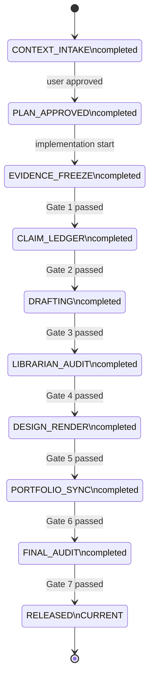

# STATE MACHINE

Last updated: 2026-03-14
Project: pjm-miso-seam-trading
Current phase: RELEASED

## Phase Summary
- Completed: initial deferred plan, seam evidence reassessment, researcher audit, librarian audit, architect implementation plan, cadence/chart requirements locked, state machine setup, thesis workspace drafting, external librarian re-audit, design render, repo spec mirror, portfolio sync, release
- In progress: none
- Pending: none

## Gates
- Gate 1: admissible source manifest locked
- Gate 2: claim ledger locked with no excluded evidence
- Gate 3: manuscript drafted with explicit non-claims section
- Gate 4: librarian audit pass
- Gate 5: public HTML rendered without semantic drift
- Gate 6: portfolio navigation synced
- Gate 7: final auditor pass

